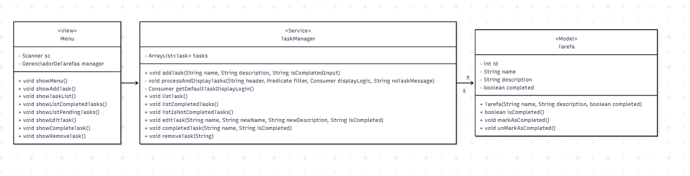

# 📝 SimpleTask


## 🎯 Sobre o Projeto
**SimpleTask** é uma aplicação de console para gerenciamento de listas de tarefas (To-Do List), desenvolvida em Java puro. O projeto foi concebido como um exercício prático para aplicar e solidificar conceitos essenciais de engenharia de software, incluindo **Programação Orientada a Objetos (POO)**, design de arquitetura em camadas e manipulação de lógica de negócio em memória.

É um projeto ideal para demonstrar a fundação do desenvolvimento em Java de forma clara e organizada.


## ✨ Funcionalidades

✔️ **Adicionar Tarefas:** Criação de novas tarefas com nome e descrição.

✔️ **Listagem Flexível:** Visualização de todas as tarefas, apenas as concluídas ou apenas as pendentes.

✔️ **Edição de Tarefas:** Modificação de nome e descrição de tarefas existentes.

✔️ **Gerenciamento de Status:** Marcar tarefas como concluídas ou reabri-las como pendentes.

✔️ **Remoção de Tarefas:** Exclusão de tarefas da lista.


## 🛠️ Tecnologias Utilizadas

* **Linguagem Principal:** `Java 17 + `
* **Gerenciador de Build:** `Apache Maven`
* **Ferramentas de Desenvolvimento:** `Git`, `IntelliJ IDEA`

---

## 🏛️ Arquitetura e Design

### Diagrama UML
O diagrama abaixo ilustra a arquitetura das classes e seus relacionamentos, seguindo uma separação clara entre a visão, ui (Menu), o service (TaskManager) e o model (Task).




### Interface de Console
A interação com o usuário é realizada através de um menu de texto simples e intuitivo:

```bash
-- Menu do SimpleTask--
1. Cadastrar nova tarefa
2. Listar todas as tarefas
3. Listar todas as tarefas não concluídas
4. Listar todas as tarefas concluídas
5. Editar tarefa
6. Concluir tarefa
7. Remover tarefa
8. Sair do programa
```

---

## 🚀 Como Executar o Projeto

Existem duas maneiras de executar o projeto: via linha de comando (método padrão) ou diretamente através do IntelliJ IDEA (recomendado para desenvolvimento).

### Método 1: Linha de Comando (Padrão)
Garante que o projeto possa ser executado em qualquer ambiente.

**Pré-requisitos:**
* Java JDK (versão 17 ou superior)
* Apache Maven (versão 3.6 ou superior)
* Git

**Instruções:**
```bash
# 1. Clone o repositório
git clone https://github.com/seu-usuario/SimpleTask.git

# 2. Navegue até o diretório
cd SimpleTask

# 3. Compile e empacote o projeto com o Maven
mvn clean install

# 4. Execute a aplicação
java -jar target/SimpleTask-1.0-SNAPSHOT.jar
```

### Método 2: Via IntelliJ IDEA (Para Desenvolvimento)
Ideal para depurar (debug) e modificar o código.

1.  Abra o IntelliJ IDEA e selecione **"Get from VCS"**.
2.  Cole a URL do repositório: `https://github.com/seu-usuario/SimpleTask.git`
3.  Aguarde o IntelliJ sincronizar o projeto via Maven.
4.  Localize a classe `Main.java`, clique com o botão direito e selecione **"Run 'Main.main()'"**.

---

## 📌 Estado Atual e Próximos Passos

* **Lógica em Memória:** Para focar na arquitetura e na lógica de negócio, a versão atual do projeto armazena as tarefas em memória. Consequentemente, **os dados não são persistidos** e são perdidos ao fechar a aplicação.
* **Identificação de Tarefas:** A busca, edição e remoção de tarefas são realizadas utilizando o **nome da tarefa** como identificador.

**Evoluções Futuras:**
* Implementar a persistência de dados utilizando arquivos **JSON**.
* Refatorar a busca de tarefas para utilizar um **ID numérico único**.
* Adicionar **testes unitários** com JUnit para validar a lógica do `TaskManager`.

---

